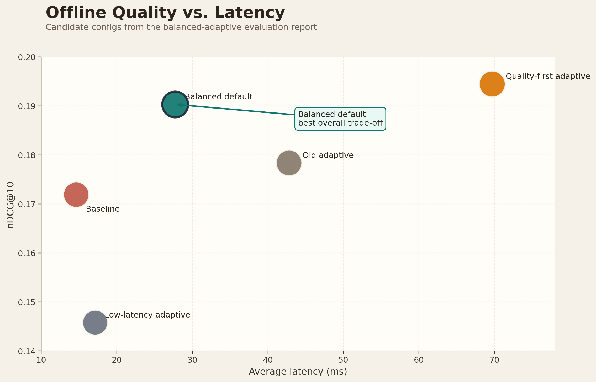
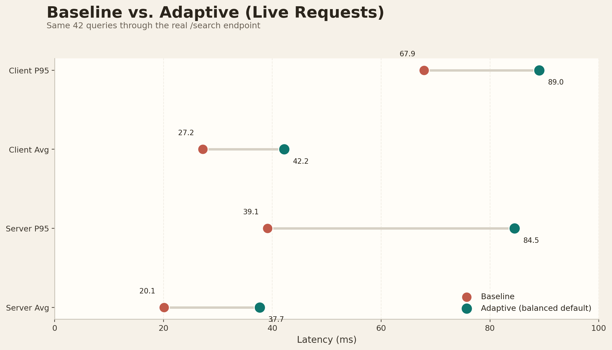
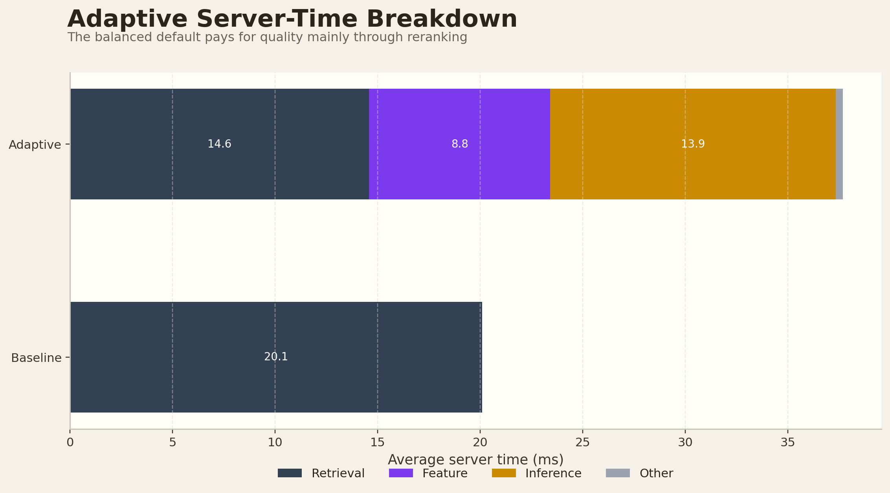
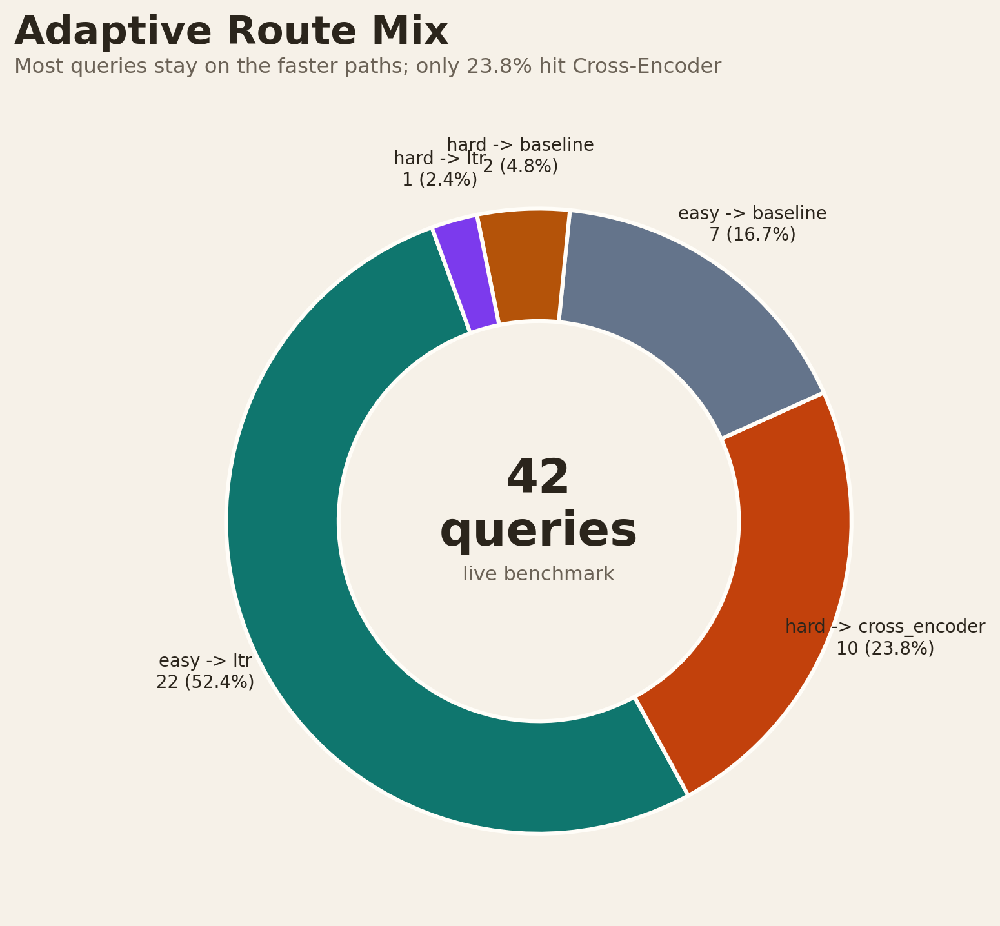
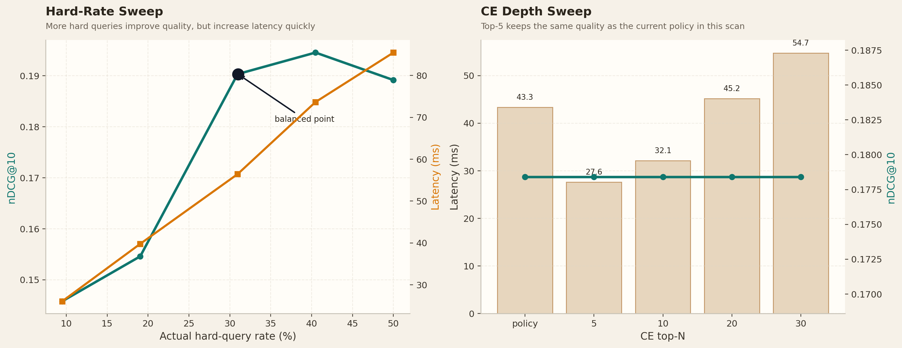
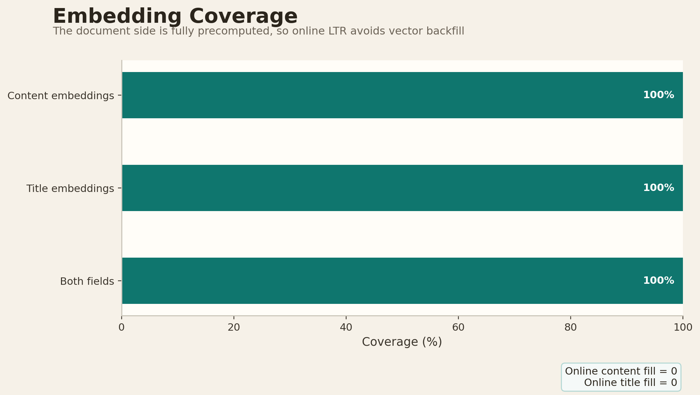

# 搜索引擎

## 这次汇报的重点

- 当前 adaptive 默认参数已经调整到一个更合理的平衡点。
- 这个配置相对 baseline，排序质量更好，在线延迟也还可以接受。
- 这个配置也优于之前的默认 adaptive：更快，也更准。
- 当前主要的尾延迟来自少量 `hard -> cross_encoder` 查询。
- 文档 embedding 已经 100% 预计算，线上没有额外补算。

## 什么是 Adaptive

可以理解为“按查询难度选择不同排序策略”。

- 如果查询比较简单，就走更轻的排序路径
- 如果查询比较复杂，就走更强的重排序路径

 adaptive 的基本思路是：

- easy query：优先走 `baseline` 或 `ltr`
- hard query：走 `cross_encoder`

也就是说，adaptive 不是给所有查询都使用最重的模型，而是只把更高的计算成本留给更难的查询。

如果直接全部使用重模型，效果可能更高，但延迟也会明显变大。  
如果全部使用 baseline，速度会更快，但排序质量会下降。  
adaptive就是在这两者之间找到一个折中点。

## 1. 总结果：离线质量和时延的关系

- 绿色高亮点就是现在采用的默认配置：`threshold=0.6062`，`hard top-k cap=5`
- baseline 更快，但排序质量更低

## 2. Baseline 和 Adaptive 的在线对比

- 现在比较的是同一批 `42` 条 query 走真实 `/search` 接口得到的结果，不是手工估算
- adaptive 的目标不是一定比 baseline 更快，而是在合理时延内换取更好的排序质量

## 3. Adaptive 的时间主要花在哪里

- 现在最大的额外开销主要不是 embedding 在线计算
- 文档 embedding 已经提前离线算好了
- 当前真正拉高延迟的，是少量 hard query 进入重排序路径后的推理成本

## 4. 为什么 Adaptive 没有慢得像全量 Cross-Encoder

- 不是所有 query 都走最重的模型
- 只有一部分 query 会走 `hard -> cross_encoder`
- 大部分 query 还是停留在更轻的路径上

所以 adaptive 的核心思路是：把重计算留给更难的查询。

## 5. 选择默认参数的原因

- 左图展示 hard-rate 提高后，质量会上升，但延迟也会上升
- 右图展示 CE top-N 提高后，延迟上升更明显，但质量收益并不总是成比例
- 所以我最后选的是一个更适合演示和实际运行的平衡点
- 这个参数不是凭感觉设定的，而是根据扫描结果选出来的

## 6. 预计算

- 这里预计算的是文档侧静态特征，不是提前知道查询答案
- 这和倒排索引、IDF 预计算、本地缓存本质上是同一类工程优化
- 它的目的，是把可以离线完成的计算提前做掉，从而降低真实查询时延

## 当前总结

- 目前这个搜索引擎原型已经能完整跑通从检索到重排序再到前端展示的主流程
- 我现在做的重点已经从“能不能跑”转到“怎么把效果和性能做平衡”
- 当前 adaptive 默认策略已经比 baseline 更准，同时在线时延仍然可控
- 接下来我还可以继续优化 hard query 路径的推理成本，并补充更完整的展示材料和实验分析
